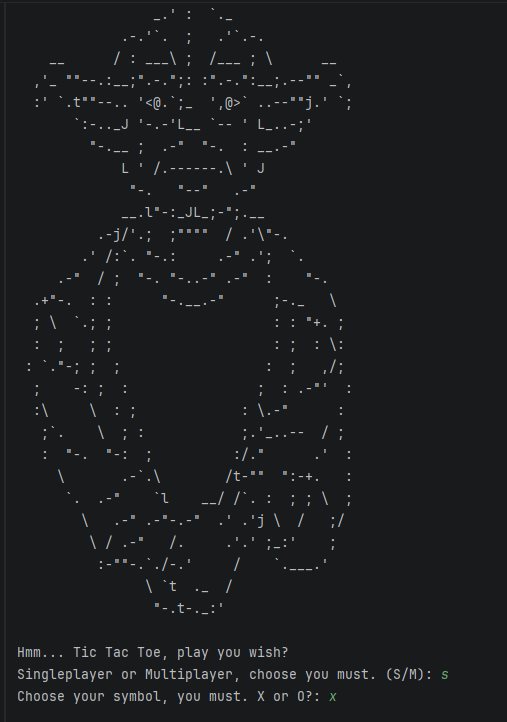
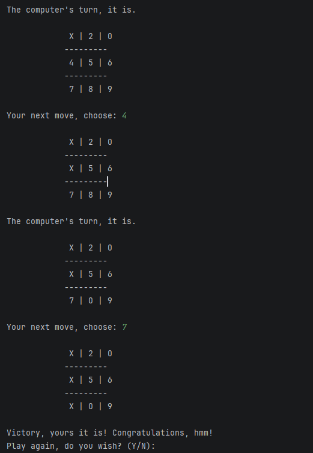

# Tic Tac Toe

A command-line Tic Tac Toe game written in Python. Play against a computer or another player directly in the terminal.

## How to Run

Clone the repository and run:

```bash
python main.py
```

## Features

- Singleplayer mode
- Multiplayer mode
- Random computer opponent
- Win and draw detection
- Input validation
- Play again option

## Screenshots

### Start Screen



### Gameplay



## Technologies

- Python 3
- Functions
- Lists
- Loops
- Conditional Statements
- Random Module
